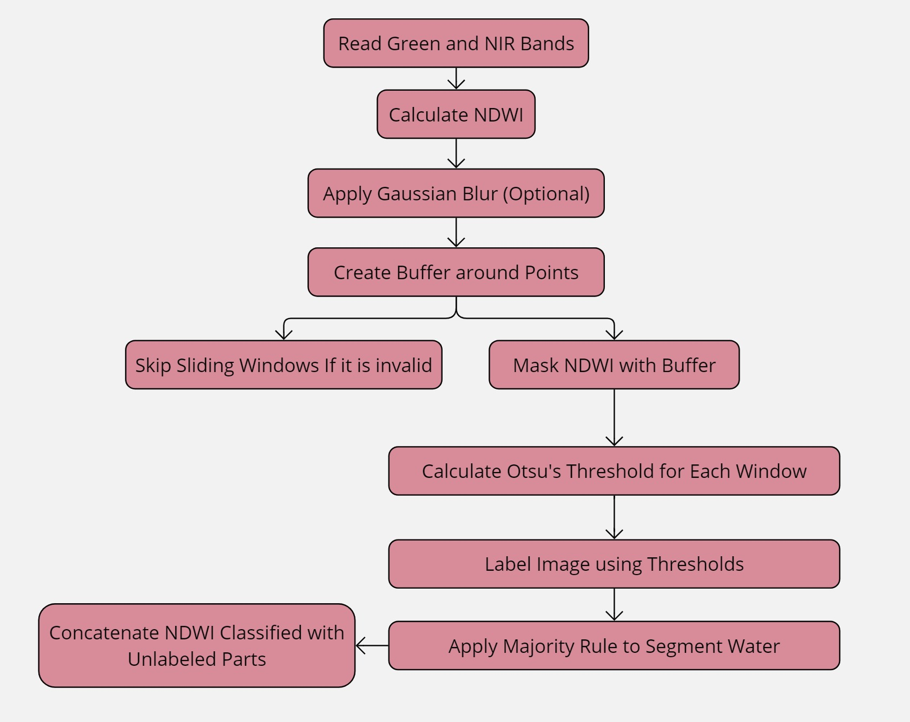
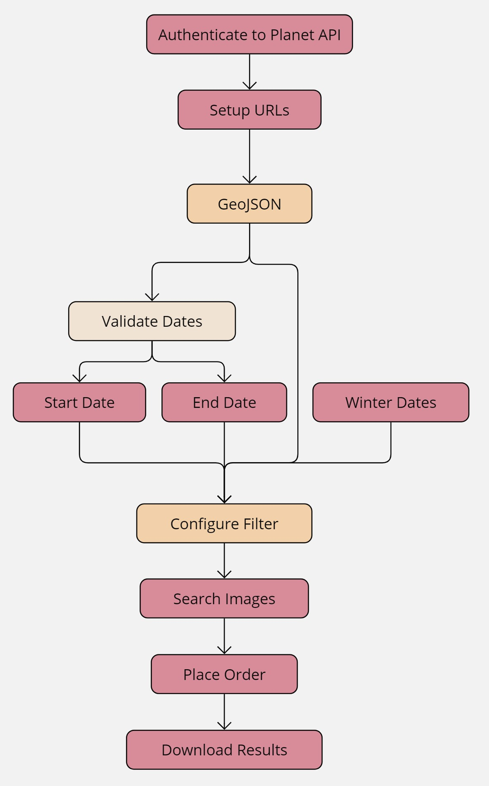

# GSoC - Final Report

## Project
### **Title:** Automated Coastline Extraction for Erosion Modeling in Alaska  
### **Mentor:** Frank Witmer

## Basic Info
| **Info**              | **Details**                                  |
|-----------------------|----------------------------------------------|
| **Name**              | Rawan Mohammed Elframawy                     |
| **Email**             | [rawann.elframawy@gmail.com](mailto:rawann.elframawy@gmail.com) |
| **GitLab Username**   | [rawann31](https://gitlab.com/rawann31)     |
| **LinkedIn**          | [rawann31](https://www.linkedin.com/in/rawann31) |
| **University**        | Nile University                              |
| **Organization**      | Alaska                                       |

## Background
My name is Rawan, and I recently graduated with a degree in Computer Science, specializing in Artificial Intelligence. I have a solid foundation in Deep Learning and Remote Sensing data, which I am eager to apply to real-world challenges. My passion lies in bridging the gap between research and practical coding, and I am excited to contribute to open-source projects through Google Summer of Code. This is my first experience with GSoC, and I am enthusiastic about the opportunity to collaborate with the global developer community and enhance my skills in a meaningful way.

## Project Overview

The primary goal of my Google Summer of Code project is to enhance the accuracy of coastline extraction, particularly for erosion modeling in Deering, Alaska, using high-resolution Planet imagery with a 3-meter resolution. The project focuses on creating reliable ground truth data and labels that will be used to train the DeepWaterMap algorithm, a deep convolutional neural network designed to segment surface water on multispectral imagery. Originally trained on 30-meter resolution Landsat data, DeepWaterMap will be adapted to work with higher-resolution data in this project.

One of the key challenges in coastline extraction is the application of the Normalized Difference Water Index (NDWI), a widely used remote sensing index for identifying water bodies. However, using a single threshold across an entire image often results in suboptimal accuracy. To address this, I implemented a sliding window approach combined with Otsu thresholding, which dynamically adjusts thresholds over localized regions of the image. This method has shown promising improvements in accuracy.

The newly generated labeled data, derived from this approach, will be used to retrain the DeepWaterMap algorithm, replacing the original Global Surface Water data. This project aims to produce a more accurate and reliable tool for coastline detection, which is crucial for monitoring and mitigating coastal erosion in vulnerable areas like Alaska.

## Contribution

| **Contribution**                          | **Description**                                                                                                                                                                                                                                                                                                                                                                            |
|-------------------------------------------|--------------------------------------------------------------------------------------------------------------------------------------------------------------------------------------------------------------------------------------------------------------------------------------------------------------------------------------------------------------------------------------------------------------------------------------------------------|
| **Planet Imagery Download Script**        | I restructured the code to enhance readability and efficiency. This included consolidating similar code blocks, optimizing logic to minimize repetition, and adding libraries like `datetime` to streamline and summarize code. Detailed comments and helper notebooks were also included for better user guidance. [View Code](https://github.com/fwitmer/CoastlineExtraction/blob/dev/DeeringAutoDownloadCode.py) |
| **Apply NDWI Sliding Window**             | Implemented a sliding window approach to segment images, replacing the single global threshold method. This technique involves using multiple overlapping windows (10 to 30 per pixel) to achieve finer water and land classification. [View Code](#)                                                                                       |
| **Skip Invalid Sliding Windows**          | Skipped some sliding windows, particularly those outside the NDWI image, to resolve issues related to invalid windows. [View Code](#)                                                                                                                                                                                                                                    |
| **Majority Sliding Window Classification** | Developed a majority-based classification system where each pixel’s classification is determined by the majority of overlapping sliding windows. This approach enhances classification accuracy by reducing the impact of isolated threshold anomalies. [View Code](#)                                                                                                    |
| **Gaussian Smoothing (Optional)**         | Incorporated optional Gaussian filtering before NDWI calculation to smooth the image and reduce noise. This step improves water body detection by mitigating noise effects, allowing users to apply it based on input data quality. [View Code](#)                                                                                                              |
| **Concatenation of Sliding Window and Mean Threshold Images** | Merged results from sliding window classification with a mean threshold image. This approach addresses unclassified regions by combining sliding window outputs with mean threshold-based classification, ensuring comprehensive segmentation and improved accuracy. [View Code](#)                                                          |

  
  

## Commits

| **Commit Name**                                                       | **Commit Link**                                          |
|-----------------------------------------------------------------------|----------------------------------------------------------|
| Replace `get_start`, `get_end`, `day_check` functions with `validate_and_compare_dates` function | [PR #16](https://github.com/fwitmer/CoastlineExtraction/pull/16) |
| Change Functions: `rem_winter`, `RE_format`, `PS_format`              | [PR #17](https://github.com/fwitmer/CoastlineExtraction/pull/17) |
| Update `date_sort` function                                           | [PR #18](https://github.com/fwitmer/CoastlineExtraction/pull/18) |
| Update to `merge_ids` function                                         | [PR #19](https://github.com/fwitmer/CoastlineExtraction/pull/19) |
| Adding additional imports, URLs, functions, enhance Documentation     | [PR #23](https://github.com/fwitmer/CoastlineExtraction/pull/23) |

